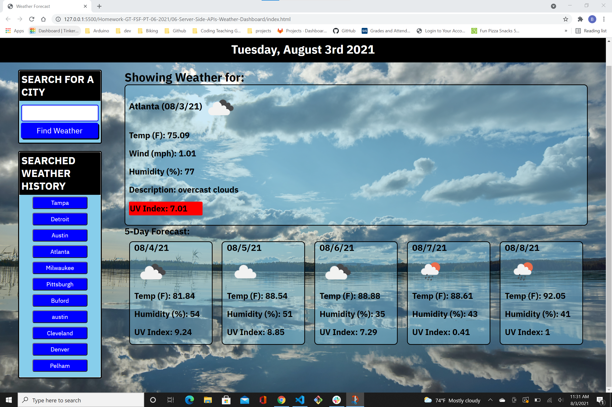
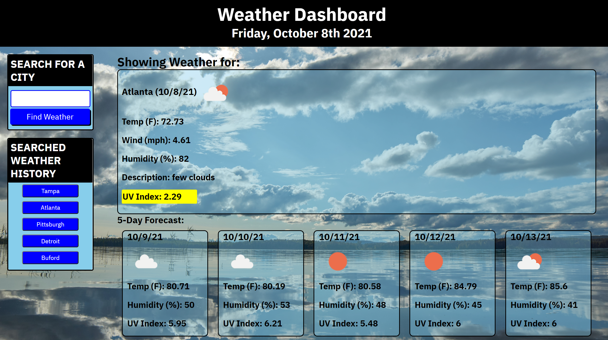

# Weather Dashboard

A an app allowing you to input a city and receive the current weather and a five day forecast.  This app provides storage of previously searched cities and renders each as a button for a quick search.

## Table of Contents

1. [Description](#description)

1. [Technologies Used](#technology)

1. [Screen Shots](#screenshots)

1. [Usage](#usage)

1. [Collaborators/Role](#collaboratorsrole)

1. [Contact Me](#contactme)

1. [License](#license)

## Technologies and skills demonstrated

* HTML, CSS, JavaScript
* API fetch to Open Weather
* Local Storage

## ScreenShot 

## Link to deployed Application on Github

https://stevenslade.github.io/WeatherDashboard/

## Collaborators

* Ben Slinde - sole author

## Conact me thru Github or access the project repo
https://github.com/stevenslade/WeatherDashboard

## License

* MIT

